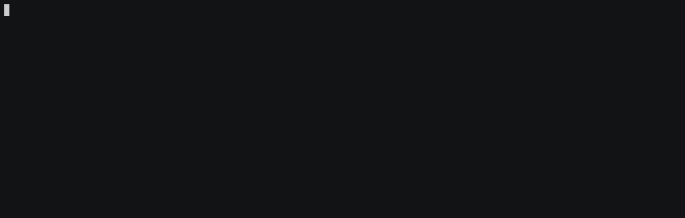

# Whale

[](https://github.com/pmalhaire/whale/actions?workflow=run%20tests)
[](https://codecov.io/gh/pmalhaire/whale)
[](https://goreportcard.com/report/github.com/pmalhaire/whale)

Whale is a fun simple card game for 2 to 4 players, you have reached the TUI version.

## curent status

The game is in development and works with small limitations :

Bonuses are not implemented yet.

## gif overview



## rules

The goal is to get 5 water jet above your whale.

To add a water jet above your whale you need to play cards.

`~ + ||` discard a wave card (`~`) and put a water card (`||`) above you : +1 water

`≈ + ||` discard a doubleWave card (`~`) and put a water card (`||`) above you : +1 water

`≈ + || + ||` discard a doubleWave card (`~`) and put two water cards (`||`) above your whale : +2 water

Game Steps :

1. Distribute 3 cards to each player
2. Choose the player to begin
3. Player plays or skip if he can't
4. Player draws a card
5. Player discards if he has more than 5 cards
6. If Player reach five water jet's he wins and ends the game
7. Next player plays continue from 3

## release

Prebuilt release binaries are available :

1. Download `tar.gz`
2. Unzip the file
3. Run `whale` :

```
./whale
```

[releases](https://github.com/pmalhaire/whale/releases)

## build

```
go build -o whaleGame main.go
```

## run

from binary

```
./whaleGame
```

from source

```
go run main.go
```

## tests

```
go test -v ./...
```

## lint

This project uses `golangci-lint` as a linter which can be found here `https://golangci-lint.run/`

```
golangci-lint run ./...
```

## Roadmap

- fix asciinema to suport utf8
- implement bonuses
- split package to make it a lib
- implement a web version using view-js
